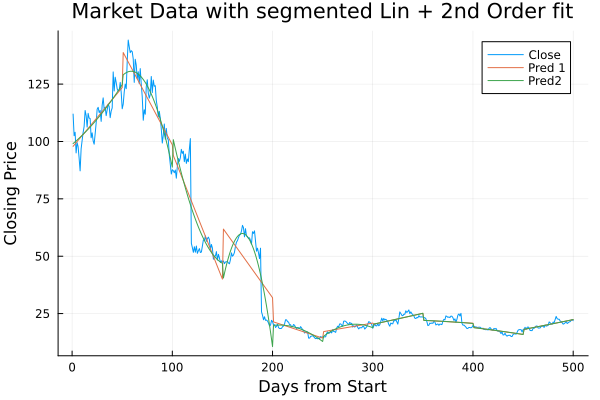

# Market Example

## Simple example tracking market data

```
using SGLM
using MarketData
using StatsPlots
using DataFrames
using StatsModels

#Load Market Data
cld=DataFrame(cl)
len=size(cld,1)
segments=10
cld.x=1:len
clseg=segment(cld, segments)

f=@formula(Close ~ x)
lmv=slm(f, clseg)
cld.pred=getPredict(lmv)

@df cld plot(:x, [:Close, :pred], label=["Close" "Predicted"])
plot!(title="Market Data with segmented Linear Fit")
yaxis!("Closing Price")
xaxis!("Days from Start")

f2=@formula(Close ~ x + x^2)
lmv2=slm(f2, clseg)
cld.pred2=getPredict(lmv2)

@df cld plot(:x, [:Close, :pred, :pred2], label=["Close" "Pred 1" "Pred 2"])
plot!(title="Market Data with segmented Linear Fit and Linear 2nd Order fit")
yaxis!("Closing Price")
xaxis!("Days from Start")
```

## Results
